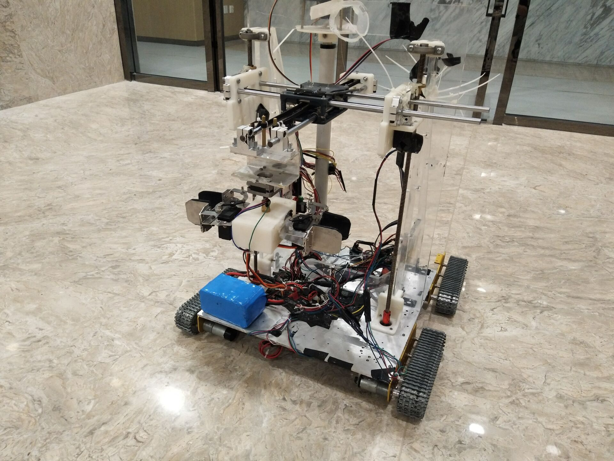
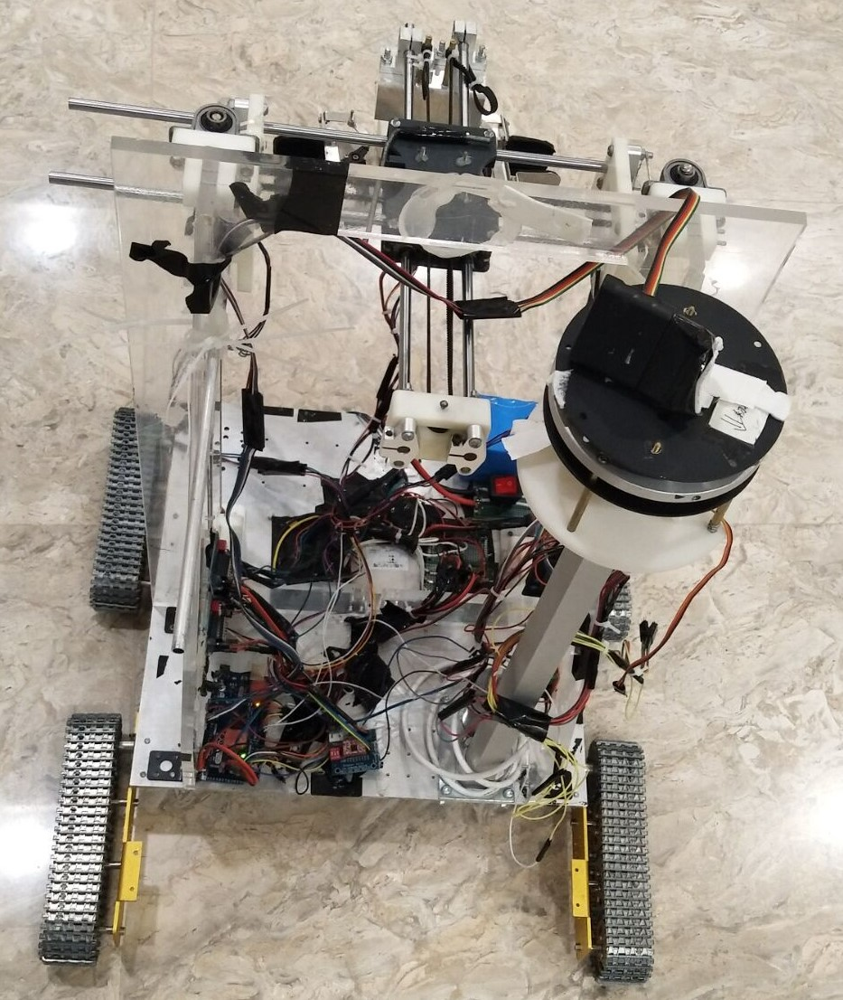
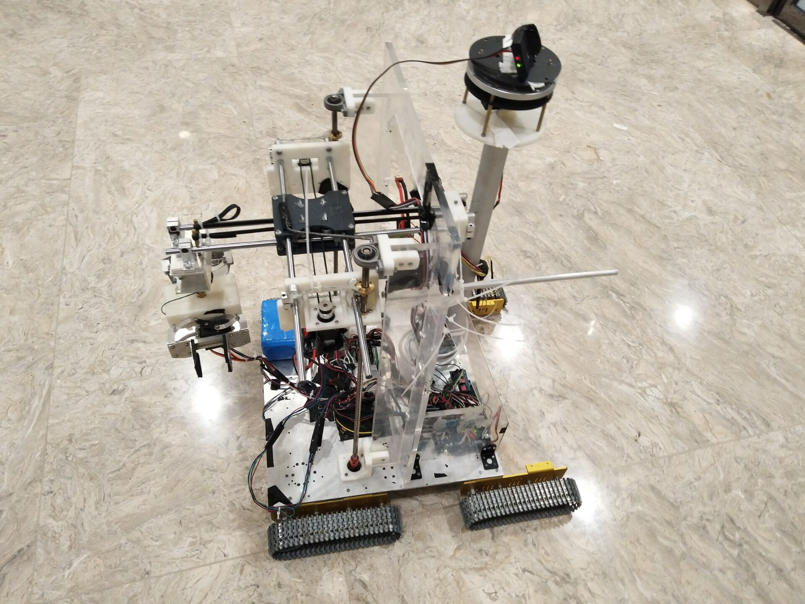

# Axibot: A Multifunctional Robot with High Precision Arm.

## Introduction

This is a work during the intern in State Key Laboratory of Intelligent Control and Decision of Complex Systems.
The work placed 4nd place in Geekpwn 2018 International Cybersecurity and AI Contest, and won 2nd prize in the Science and Technology Works Competition of Beijing Institute of Technology.

We establish the core control system through Arudino microcontroller, and the video transmission system through Raspberry Pi. Modifying the CoreXY structure commonly used in 3d printers, we realize the three-dimensional high-precision movement of the robot arm with the screw and other structures. We further innovatively propose an end structure to achieve the switching of the actuator. A unified power supply system is also designed based on the voltage conversion module.

At the software level, we implement the high-sensitivity wireless control through the optimization algorithm, stabilizing the chassis movement through the closed-loop PID speed regulation mechanism. A real-time video transmission system is also established.

   

## Implementation

Model & Quantity

Arduino Mega 2560 x 2
Raspberry Pi Zero W x 1
Step Motor (A4988 Enabled) x 5
Servo x 2
DC motor (L298N Enabled) x 4
Main Camera x 1
Secondary Camera x 1
2.4G contorller x 1
Regulator Module x 1
Others: Li-ion Battery (&Meter)

## Teamwork

Yue Sun: Hardware & Software Development, machine design

Shuo Wang: Hardware Development, machine design

Yufeng Wu: Hardware Development

Date: 10/27/2018

